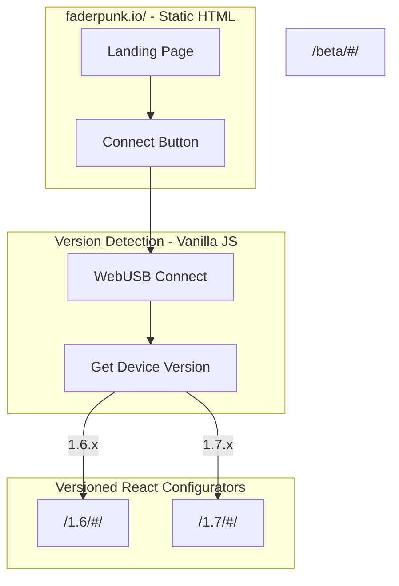

# Versioned Configurator Deployment

## Architecture Overview



## Key Changes

### 1. Static Landing Page (New)

Create a new static landing page at [`configurator/landing/index.html`](configurator/landing/index.html) (outside `public/` so it's not bundled with React):

- **Styling**: Embedded `<style>` tag matching configurator theme
- **Logo**: Reuse existing `/img/fp-logo-alt.svg`
- **Connect button**: Vanilla JS WebUSB to detect device version and redirect
- **Links**: Troubleshooting, About (link to latest versioned configurator's pages)
```html
<!DOCTYPE html>
<html>
<head>
  <meta charset="UTF-8" />
  <meta name="viewport" content="width=device-width, initial-scale=1.0" />
  <title>Faderpunk Configurator</title>
  <style>
    * { box-sizing: border-box; margin: 0; padding: 0; }
    body {
      min-height: 100vh;
      display: flex;
      align-items: center;
      justify-content: center;
      background: #6b7280;
      font-family: system-ui, sans-serif;
    }
    .card {
      display: flex;
      flex-direction: column;
      align-items: center;
      gap: 2rem;
      padding: 2.5rem;
      border: 3px solid #ec4899;
      border-radius: 4px;
      box-shadow: 0 0 11px 2px rgba(183, 178, 178, 0.25);
    }
    .logo { width: 12rem; }
    .connect-btn {
      padding: 0.75rem 1.5rem;
      background: #ec4899;
      color: white;
      border: none;
      border-radius: 4px;
      font-size: 1rem;
      cursor: pointer;
      box-shadow: 0 0 11px 2px rgba(183, 178, 178, 0.25);
    }
    .connect-btn:hover { background: #db2777; }
  </style>
</head>
<body>
  <div class="card">
    
    <button id="connect" class="connect-btn">Connect Device</button>
  </div>
  <script>
    document.getElementById('connect').onclick = async () => {
      const device = await navigator.usb.requestDevice({
        filters: [{ vendorId: 0x2E8A }] // Raspberry Pi
      });
      await device.open();
      const minor = `${device.deviceVersionMajor}.${device.deviceVersionMinor}`;
      window.location.href = `/${minor}/#/`;
    };
  </script>
</body>
</html>
```


### 2. Workflow Changes for Versioned Deployment

Modify [`.github/workflows/release.yml`](.github/workflows/release.yml):

**In `build_configurator_for_release` job** - add version extraction before build:

```yaml
- name: Extract minor version
  id: version
  run: |
    TAG="${{ needs.release-please.outputs.configurator_tag_name }}"
    # Extract "1.7" from "configurator-v1.7.2"
    MINOR=$(echo "$TAG" | sed -E 's/.*v([0-9]+\.[0-9]+).*/\1/')
    echo "minor=$MINOR" >> $GITHUB_OUTPUT

- name: Build configurator
  run: pnpm run build
  working-directory: ./configurator
  env:
    BASE_URL: /${{ steps.version.outputs.minor }}/
```

**In `deploy_configurator_to_pages` job** - deploy to versioned subfolder + landing page:

```yaml
- name: Checkout repository
  uses: actions/checkout@v5
  with:
    fetch-depth: 0

- name: Checkout gh-pages branch
  uses: actions/checkout@v5
  with:
    ref: gh-pages
    path: gh-pages

- name: Download configurator artifact
  uses: actions/download-artifact@v5
  with:
    name: configurator-pages-main-artifact
    path: configurator-dist

- name: Extract minor version
  id: version
  run: |
    TAG="${{ needs.release-please.outputs.configurator_tag_name }}"
    MINOR=$(echo "$TAG" | sed -E 's/.*v([0-9]+\.[0-9]+).*/\1/')
    echo "minor=$MINOR" >> $GITHUB_OUTPUT

- name: Deploy to gh-pages
  run: |
    MINOR="${{ steps.version.outputs.minor }}"
    
    # Deploy versioned configurator to /1.7/
    rm -rf "gh-pages/${MINOR}"
    mkdir -p "gh-pages/${MINOR}"
    cp -r configurator-dist/* "gh-pages/${MINOR}/"
    
    # Remove CNAME from versioned subfolder (should only be at root)
    rm -f "gh-pages/${MINOR}/CNAME"
    
    # Deploy static landing page to root
    # Remove old root files but preserve: beta/, 1.*/, .git/, CNAME
    find gh-pages -maxdepth 1 -type f ! -name 'CNAME' ! -name '.gitignore' -delete
    rm -rf gh-pages/assets
    
    # Copy landing page files
    cp configurator/landing/index.html gh-pages/
    cp -r configurator/public/img gh-pages/
    
    cd gh-pages
    git config user.name "github-actions[bot]"
    git config user.email "github-actions[bot]@users.noreply.github.com"
    git add .
    git commit -m "Deploy configurator ${{ needs.release-please.outputs.configurator_tag_name }} to /${MINOR}/" || echo "No changes to commit"
    git push origin gh-pages
```

**Note**: The landing page should be created at `configurator/landing/index.html` (outside `public/` so it's not bundled with the React app).

### 3. Remove Version Compatibility Check (Cleanup)

Since the landing page now handles version routing, the configurator no longer needs to check firmware compatibility. Remove from [`configurator/src/consts.ts`](configurator/src/consts.ts):

```typescript
// REMOVE this line:
export const FIRMWARE_MIN_SUPPORTED = "1.5.0";
```

Update [`configurator/src/store.ts`](configurator/src/store.ts) - remove the update redirect logic:

```typescript
// REMOVE this block from connect():
const updateRequired =
  deviceVersion && semverLt(deviceVersion, FIRMWARE_MIN_SUPPORTED);
if (updateRequired) {
  navigate("/update");
  return;
}
```

Keep `FIRMWARE_LATEST_VERSION` - it's still useful for showing "update available" notifications.

### 4. gh-pages Structure

After implementation:

```
gh-pages/
  index.html          # Static landing page (version router)
  img/
    fp-logo-alt.svg
  1.5/                # Configurator 1.5.x (preserved from previous releases)
    index.html
    assets/
  1.6/                # Configurator 1.6.x
    index.html
    assets/
  beta/               # Latest beta (unchanged)
    index.html
    assets/
  CNAME               # Custom domain
```

## Edge Cases to Handle

- **Unknown/future firmware version**: Redirect to latest available version, configurator can show warning
- **WebUSB not supported**: Show error message with link to supported browsers
- **Very old firmware**: Redirect to oldest available version
- **Direct link to versioned path**: Works normally (each configurator is self-contained)
- **Beta users**: `/beta/` continues to work as before, always latest beta