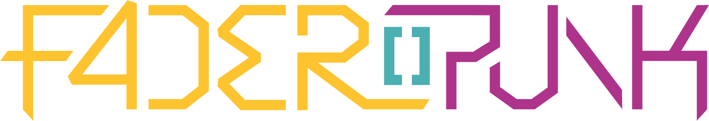

# Faderpunk Configurator

A React/TypeScript web application for configuring Faderpunk via WebUSB. The configurator provides a modern, intuitive interface for managing device layouts, apps, and global settings.



## Overview

The Faderpunk Configurator is the primary interface for setting up and customizing your Faderpunk device. It communicates directly with the hardware via WebUSB, allowing real-time configuration of:

- **Device Layout**: Arrange and configure apps across the 16 channels
- **App Management**: Browse available apps, configure parameters, and assign them to channels
- **Global Settings**: Configure MIDI, I2C, clock, quantizer, and auxiliary settings
- **Real-time Updates**: Changes are immediately synchronized with the hardware

## Features

### 🎛️ **Device Tab**
- **Visual Channel Overview**: See all 16 channels at a glance with their assigned apps
- **Drag & Drop Layout**: Intuitive interface for rearranging apps across channels
- **Real-time Status**: Live display of fader positions, button states, and LED colors
- **Quick Configuration**: Click any channel to instantly configure its assigned app

### 📱 **Apps Tab**
- **App Library**: Browse all available apps with descriptions and icons
- **Categorized Browsing**: Apps organized by function (LFO, Sequencer, Utility, etc.)
- **Parameter Configuration**: Rich UI for configuring app-specific parameters including:
  - Boolean switches and toggles
  - Numeric inputs with validation
  - Color pickers for LED customization
  - Curve and waveform selectors
  - Note and range inputs
  - Enum dropdowns for mode selection

### ⚙️ **Settings Tab**
Comprehensive global device configuration:

- **MIDI Settings**: Configure MIDI input/output channels and routing
- **I2C Settings**: Set up communication with Eurorack modules (16n protocol)
- **Clock Settings**: External clock synchronization and timing
- **Quantizer Settings**: Musical quantization and scale configuration
- **Auxiliary Settings**: Additional device-specific configurations

## Technology Stack

### Frontend Framework
- **React 19** with TypeScript for type-safe development
- **Vite** for fast development and optimized builds
- **HeroUI** component library for modern, accessible UI components
- **Tailwind CSS** for utility-first styling
- **Zustand** for lightweight state management

### Key Libraries
- **@dnd-kit**: Drag and drop functionality for layout management
- **react-hook-form**: Form handling with validation
- **framer-motion**: Smooth animations and transitions
- **zod**: Runtime type validation and schema definition
- **classnames**: Conditional CSS class management

### Hardware Communication
- **WebUSB API**: Direct browser-to-device communication
- **COBS Encoding**: Consistent Overhead Byte Stuffing for reliable data transmission
- **Postcard Serialization**: Efficient binary serialization protocol
- **Type-safe Protocol**: Generated TypeScript bindings from Rust types

## Prerequisites

### Browser Support
WebUSB is required for device communication. Supported browsers:
- ✅ Chrome/Chromium 61+
- ✅ Edge 79+
- ✅ Opera 48+
- ❌ Firefox (WebUSB not supported)
- ❌ Safari (WebUSB not supported)

### Hardware Requirements
- Faderpunk device with USB connection
- Compatible Raspberry Pi Pico (RP2350) firmware

## Getting Started

### Installation

1. **Clone the repository:**
   ```bash
   git clone https://github.com/ATOVproject/faderpunk.git
   cd faderpunk/configurator
   ```

2. **Install dependencies:**
   ```bash
   pnpm install
   ```

### Development

Start the development server:
```bash
pnpm dev
```

The configurator will be available at `http://localhost:5173`

### Building for Production

Build the application:
```bash
pnpm build
```

The built files will be available in the `dist/` directory.

### Linting and Type Checking

Run ESLint:
```bash
pnpm lint
```

Run TypeScript type checking:
```bash
tsc --noEmit
```

## Usage

### Connecting to Your Device

1. **Power on** your Faderpunk device and connect it via USB
2. **Open the configurator** in a supported browser
3. **Click "Connect Device"** to initiate the WebUSB connection
4. **Select your Faderpunk device** from the browser's device picker
5. **Start configuring!** The device will automatically sync its current state

### Managing Apps

1. **Browse Apps**: Navigate to the "Apps" tab to see all available applications
2. **Drag to Assign**: Drag apps from the library onto channels in the "Device" tab
3. **Configure Parameters**: Click on any assigned app to open its configuration modal
4. **Real-time Updates**: Changes are immediately sent to the hardware

### Layout Management

- **Drag & Drop**: Rearrange apps by dragging them between channels
- **Multi-channel Apps**: Some apps can span multiple channels for expanded functionality
- **Empty Channels**: Unused channels remain available for future app assignment
- **Save Layouts**: Device automatically saves layout changes to persistent storage

## Architecture

### Component Structure

```
src/
├── components/           # React components
│   ├── input/           # Parameter input components
│   ├── settings/        # Settings tab components
│   ├── App.tsx         # Main application component
│   ├── Layout.tsx      # Layout wrapper with modals
│   └── ...
├── utils/              # Utility functions
│   ├── usb-protocol.ts # WebUSB communication
│   ├── config.ts       # Device configuration helpers
│   └── types.ts        # TypeScript type definitions
├── store.ts            # Zustand state management
└── main.tsx           # Application entry point
```

### State Management

The application uses Zustand for state management with the following key state:

- `usbDevice`: Active WebUSB device connection
- `apps`: Map of all available apps with metadata
- `layout`: Current channel layout and app assignments
- `config`: Global device configuration settings

### Communication Protocol

The configurator communicates with the Faderpunk firmware using:

1. **COBS Encoding**: Frames messages for reliable transmission
2. **Postcard Serialization**: Compact binary format for efficiency
3. **Type-safe Messages**: Generated TypeScript types from Rust protocol definitions
4. **Bidirectional Communication**: Real-time updates and configuration sync

## Development Guide

### Adding New App Parameters

1. **Define the parameter** in the firmware's Rust code
2. **Regenerate bindings** using `./gen-bindings.sh` from the project root
3. **Create UI component** in `src/components/input/` for the new parameter type
4. **Update** `AppParam.tsx` to handle the new parameter type

### Extending Settings

1. **Add new setting** to `GlobalConfig` in the shared library
2. **Regenerate TypeScript bindings**
3. **Create settings component** in `src/components/settings/`
4. **Import and use** in `SettingsTab.tsx`

### Protocol Debugging

Enable USB protocol debugging by opening browser dev tools:
- Messages are logged to the console
- WebUSB errors are clearly reported
- COBS encoding/decoding can be inspected

## Browser Compatibility

| Feature | Chrome | Edge | Firefox | Safari |
|---------|--------|------|---------|--------|
| WebUSB | ✅ | ✅ | ❌ | ❌ |
| ES2022 | ✅ | ✅ | ✅ | ✅ |
| CSS Grid | ✅ | ✅ | ✅ | ✅ |
| Drag & Drop | ✅ | ✅ | ✅ | ✅ |

**Note**: WebUSB is the limiting factor. Firefox and Safari users cannot connect to the device directly but can still view the interface.

## Troubleshooting

### Connection Issues

**Device not appearing in browser picker:**
- Ensure device is powered on and connected via USB
- Try a different USB cable or port
- Check that firmware is properly flashed

**WebUSB not available:**
- Use Chrome, Edge, or Opera browser
- Ensure browser is up to date
- Check that site is served over HTTPS (required for WebUSB)

**Connection drops unexpectedly:**
- Check USB cable connection
- Avoid USB hubs if possible
- Monitor browser console for error messages

### Performance Issues

**Slow drag and drop:**
- Close other browser tabs to free memory
- Disable browser extensions that might interfere
- Try refreshing the page

**Laggy parameter updates:**
- Reduce the number of simultaneous parameter changes
- Check USB connection stability
- Monitor browser performance tools

### Protocol Errors

**COBS decoding errors:**
- Usually indicates USB transmission issues
- Try reconnecting the device
- Check for firmware compatibility

**Serialization errors:**
- May indicate version mismatch between configurator and firmware
- Ensure both are from the same release
- Check browser console for detailed error messages

## Contributing

### Development Setup

1. Fork the repository
2. Create a feature branch
3. Install dependencies with `pnpm install`
4. Make your changes
5. Run tests and linting
6. Submit a pull request

### Code Style

- **TypeScript**: Strict mode enabled with comprehensive type checking
- **ESLint**: Configured with React and TypeScript rules
- **Prettier**: Automatic code formatting
- **Naming**: Use descriptive names and follow React conventions

### Testing

Currently using manual testing with hardware. Automated testing infrastructure is planned for future releases.

## License

This project is licensed under the terms specified in the [LICENSE](LICENSE) file.

## Support

- **Community**: [Discord Server](https://atov.de/discord)
- **Issues**: [GitHub Issues](https://github.com/ATOVproject/faderpunk/issues)
- **Website**: [atov.de](https://atov.de)

## Acknowledgments

- Built with ❤️ in Berlin by ATOV
- UI and UX by the wonderful and extraordinarily talented [Leise St. Clair](https://github.com/estcla)
- Icon design by [papernoise](https://www.papernoise.net)
- log, lin and exp icons by [Robbe de Clerck](https://thenounproject.com/creator/declerckrobbe/)
- MIDI icon by [onlinewebfonts](https://www.onlinewebfonts.com/icon/496520)
- Some UI components based on HeroUI

---

**Faderpunk Configurator** - Bridging the gap between digital configuration and analog performance.
