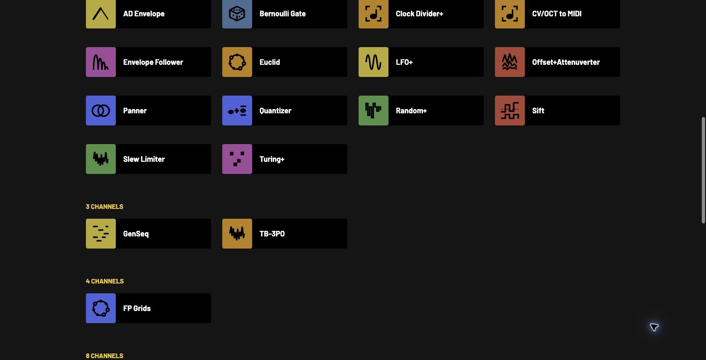
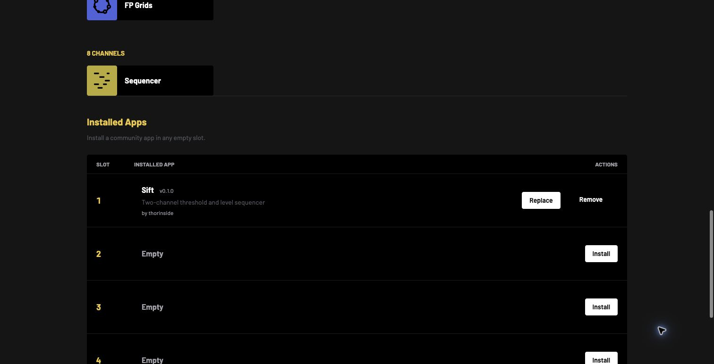
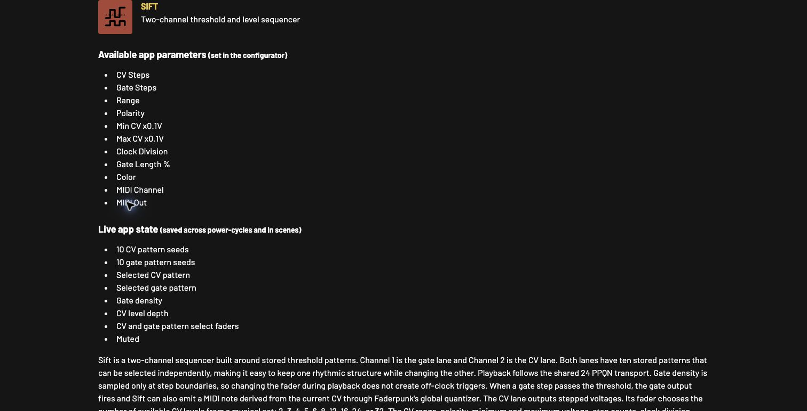

# Installable native `.fpapp` applications

Status: **implemented and hardware-tested prototype, pending maintainer acceptance**
Container version: `0`
Runtime ABI version: `1`

## Summary

This proposal lets a player install, replace, and remove community applications
without replacing the complete Faderpunk firmware image. The Configurator's
existing **Apps** page shows four app slots. A player selects a `.fpapp` file,
reviews the app and its setup notes, confirms that they trust its source, and
installs it over the normal configuration connection. The app then appears in
the ordinary app catalogue and layout editor alongside built-in apps.

The implementation reuses Faderpunk's Rust `App<N>` programming model.
Community source is compiled as read-only position-independent Thumb code
against one exact firmware build and called through a small, versioned host
table. There is no bytecode language, interpreter, second app implementation,
or firmware reflash for each app.

## Motivation

Today, trying one community app means producing and flashing a different full
firmware image. That has several long-term costs:

- players must enter BOOTSEL mode and replace firmware to add or remove one app;
- every combination of community apps becomes a separate firmware build;
- app authors test a firmware fork instead of the artifact players will use;
- a community contribution is coupled to firmware registration and release;
- documentation and setup information are separated from the installed code.

FPApps make firmware a platform release and community apps independently
installable artifacts. BOOTSEL remains the recovery path for firmware itself,
but it is no longer part of the normal app workflow.

## Player experience

1. Install an FPApp-capable firmware release once.
2. Connect Faderpunk to the Configurator normally.
3. Open **Apps** and scroll to **Installed Apps**.
4. Choose an empty slot and select a `.fpapp` file.
5. Review the app name, author, and description, then confirm that the app and
   its source are trusted.
6. Install it. The Configurator refreshes the app catalogue automatically.
7. Add the app to a layout and configure it exactly like a built-in app.

Installation uses Faderpunk's USB MIDI configuration cable, so the browser
must support Web MIDI with SysEx permission (Chrome and other Chromium-based
browsers do).

There are four independent slots. An interrupted upload leaves only its chosen
slot empty; the player can select the file and install it again. Replacing or
removing an app automatically stops all of its running instances and removes
them from the saved channel layout before changing the slot.

There is intentionally no separate FPApps tab. Slots are installation
management, while installed applications are ordinary applications.

## Goals

- Install community apps without reflashing firmware.
- Keep one Rust source implementation for built-in and installable builds.
- Preserve the familiar `App<N>` facade for app authors.
- Support the firmware services real apps depend on, including clock, I2C,
  quantizer, MIDI, CV, gates, LEDs, parameters, scenes, and persistence.
- Make package parsing and installation bounded and allocation-free in firmware.
- Make incomplete or incompatible packages unable to enter the app catalogue.
- Keep each upload failure local to one recoverable slot.
- Carry the app manual, setup notes, and Configurator metadata with the app.
- Build every catalogued community app reproducibly into one output directory.

## Non-goals and trust boundary

- FPApps are not sandboxed. They are trusted native machine code with firmware
  privilege.
- Runtime ABI v1 is not a stable Rust ABI. A package is accepted only by the
  exact firmware build it targets.
- FPApps do not replace firmware releases, BOOTSEL recovery, or built-in apps.
- The first version does not pre-empt or contain a misbehaving native app.
- CRC32 detects incomplete or damaged packages; it does not identify a
  publisher. The signing section is reserved but not yet enforced.
- This runtime is intended for control-rate Faderpunk apps, not audio-rate DSP.

The Configurator therefore requires an explicit trust confirmation. Community
CI should publish packages built from reviewed source; opaque contributor
binaries should not become the source of truth.

## Design decisions

### Native code compiled for one firmware

Program kind `1` is a read-only, position-independent Thumb image. The package
contains a 32-byte firmware compatibility identity. Normal release builds
derive it from the full 40-digit Git revision. Firmware and Configurator both
require an exact match before installation.

An explicit `FPAPP_FIRMWARE_ABI=<64 hex digits>` build setting exists for
uncommitted development firmware. It lets hardware tests bind packages to the
exact test binary without pretending the dirty tree is its parent commit.
Distributed releases should use the clean commit-derived identity.

This choice is intentionally simple: the host table may evolve without
promising a stable Rust compiler ABI, and stale packages cannot execute after a
firmware change. The tradeoff is that packages must be rebuilt and reinstalled
after updating to an incompatible firmware.

Compatibility has two explicit layers:

- the runtime ABI version identifies the published `HostV1` layout and its
  behavioral contract. Once ABI 1 ships, an incompatible table or semantic
  change must increment this field and introduce a correspondingly named host
  table;
- the 32-byte firmware identity binds a package to one exact compatible build.
  It changes for every release revision (and for each explicitly identified
  development build), even when the runtime ABI version stays the same.

The runtime ABI is therefore a generation number, not a promise that one
native Rust image can run on every firmware in that generation. Firmware still
requires the exact identity. This deliberately conservative rule allows the
project to relax compatibility later without ever running a stale package by
accident. ABI 1 remains version 1 during this work because it has not yet been
released.

### Four slots, no A/B slots

The final 512 KiB of the supported 2 MiB flash is split into four independent
128 KiB slots. Each has a 4 KiB control sector and up to 124 KiB of package
data. Beginning an upload invalidates that slot. Commit writes its control
record only after all package and compatibility checks succeed.

An A/B pair would halve the useful number of apps and is unnecessary for this
recovery model. A failed app upload does not make firmware unbootable; the
player simply uploads that app again. Other slots are untouched.

### A compatibility facade, not a second app API

The community repository continues to contain the same module shape as a
built-in app: `CHANNELS`, `CONFIG`, a wrapper task, and `run(&App<N>)`. The
builder preserves the app logic and mechanically replaces only the static
Embassy task shell with an exported FPApp future. Parameter and storage
constructors receive the host reference, and the one global-config call used
by current apps is routed through the app facade.

This keeps review focused on one implementation. The compatibility facade is
also useful beyond the current catalogue: it exposes services that Heat Pump,
Grooves, and Sift do not all use today, rather than hard-coding three ports.

## Architecture

```text
community Rust source + catalog + manual
                  |
                  v
        fpapp build-community
                  |
                  v
              .fpapp file
                  |
                  v
Configurator Apps page -- config SysEx --> transactional SlotStore
                                               |
                                               v
                                  installed app catalogue
                                               |
                                               v
                                  native runtime + HostV1
                                               |
                                               v
                                    firmware App<N> services
```

The implementation is split at narrow ownership boundaries:

- `libfp::fpapp` parses and builds the bounded package container.
- `libfp::fpapp_store` owns slot transactions behind a `SlotFlash` interface;
  unit tests use an in-memory implementation.
- `faderpunk::fpapps` adapts RP2350 flash and exposes only validated installed
  metadata and native entrypoint descriptors.
- `faderpunk::fpapp_runtime` owns one running instance, its event log, host
  table, commands, persistence requests, and safe channel cleanup.
- `fpapp-sdk` owns the C-compatible host contract and source-compatible
  `App<N>` facade.
- `fpapp` owns ELF validation, packaging, inspection, verification, and the
  community-repository build pipeline.
- the Configurator owns local preview, transfer, slot management, documentation
  hooks, and catalogue refresh.

Layout and UI code do not know flash offsets or native entrypoint details.
Package tooling does not know how firmware schedules an instance.

## Firmware service compatibility

Host ABI v1 uses a size- and version-tagged `#[repr(C)]` `HostV1` table. All
channels exposed to an app are relative to its assigned layout span.

The host also supplies the app future's `RawWakerVTable`. Function pointers in
that table are linked at their real firmware addresses instead of being stored
as absolute link-time addresses inside the relocatable app image. The package
builder retains ELF relocation records for auditing and accepts only the
position-relative relocation kinds used by Thumb ROPI code; absolute or unknown
relocations fail the build.

| App facility | Host behavior in v1 |
| --- | --- |
| identity and layout | app ID, start channel, layout ID |
| faders | current values and independent change waiters |
| buttons and Shift | down, up, long press, current pressed state |
| clock | persistent subscription; 64-bit tick, start, stop, reset, division filtering |
| scenes | load and save events |
| parameters | load/save values, receive edits, answer value requests |
| app storage | default and per-scene FRAM records using existing addresses and postcard encoding |
| timers | monotonic millisecond delays; the host records the earliest requested deadline and sleeps until it instead of immediately repolling a pending timer |
| CV input/output | 0-10 V, 0-5 V, and bipolar jack modes and values |
| gates | configure level, set high, set low |
| LEDs | top/bottom/button and all current `LedMode` variants |
| MIDI output | CC/NRPN, note on, and note off through existing USB/DIN routing |
| MIDI input | USB/DIN selection, channel filtering, all channel messages, and NRPN |
| I2C | relative-channel fader values through the existing leader publisher |
| random | RP2350 ring-oscillator random values |
| quantizer | live global key and tonic, hysteretic pitch conversion, bypass and `Key::Off` behavior |
| global settings | swing and fader takeover mode |
| app helpers | `Global`, `Arr`, and analog latch behavior |

Each app future has at most 8 KiB of aligned instance storage. Firmware owns a
64-event ring and a 32-command queue per running instance. Independent
`EventReader` cursors let concurrent fader, button, clock, scene, parameter,
and MIDI tasks observe the same event instead of stealing it from one another.
If an app falls more than 64 relevant events behind, the oldest events are
discarded, matching the bounded nature of the firmware pub/sub paths.

The runtime owns up to 16 Embassy task instances, matching Faderpunk's 16
layout channels. App completion, initialization failure, exit, or layout
replacement drops the future, drains pending service cleanup, and returns all
owned jacks to high impedance.

## Flash allocation and transaction

```text
0x1000_0000 .. 0x1018_0000  firmware image       1536 KiB
0x1018_0000 .. 0x1020_0000  FPApp region          512 KiB
```

The firmware linker is restricted to the first 1536 KiB, so a normal firmware
image cannot overlap package storage.

Installation is intentionally one-way and recoverable:

1. Reject an invalid slot, zero length, oversize package, or busy installer.
2. If the installed app is active, stop every layout instance and wait for the
   layout manager to acknowledge that its task has exited and released its
   hardware. Persist the cleared layout.
3. Erase the chosen control sector first, making the slot empty.
4. Erase enough package sectors for the declared length.
5. Accept strictly sequential chunks of at most 256 bytes.
6. Reparse the complete package directly from mapped flash.
7. Validate container, CRC, manifest, native envelope, entrypoint offsets,
   exact firmware identity, duplicate app ID, and the 8 KiB runtime-state
   bound. A package that cannot launch never enters the catalogue.
8. Write the CRC-protected control record last and refresh the catalogue.

A reset during steps 3-7 exposes an empty slot after reboot. No partial package
is considered installed. Removing an app erases only its control sector.

## `.fpapp` container v0

All fixed-width integers are unsigned little-endian. Section offsets are from
the first package byte and are four-byte aligned.

### Fixed header

| Offset | Size | Field |
| ---: | ---: | --- |
| 0 | 8 | magic `FPAPP\0\r\n` |
| 8 | 2 | container version (`0`) |
| 10 | 2 | runtime ABI version (`1`) |
| 12 | 4 | total package length |
| 16 | 2 | section count, at most 16 |
| 18 | 2 | header plus section-table length |
| 20 | 4 | CRC32 of all bytes after the section table |

Each 12-byte descriptor is `kind: u16`, `flags: u16`, `offset: u32`, and
`length: u32`. Flag bit zero means required. Sections may not overlap the table
or one another. Unknown optional sections are skipped; unknown required
sections reject the package.

| Kind | Required | Contents |
| ---: | :---: | --- |
| 1 | yes | CBOR manifest |
| 2 | yes | native program envelope and image |
| 3 | no | UTF-8 manual document; community packages use `faderpunk-manual-v1` JSON |
| 4 | no | UTF-8 Markdown setup notes |
| 5 | no | UTF-8 JSON Configurator metadata/settings hook |
| 6 | no | opaque signing metadata reserved for future policy |

### Manifest

The CBOR map has integer keys so firmware can parse it without allocation.

| Key | Field | Constraint |
| ---: | --- | --- |
| 0 | app ID | `100..=255` |
| 1 | version | three `u16` values |
| 2 | program kind | `1` for Thumb ROPI |
| 3 | name | ASCII, 1-32 bytes |
| 4 | description | ASCII, 1-96 bytes |
| 5 | author | UTF-8, 1-64 bytes |
| 6 | channels | `1..=16` |
| 7 | display color | 24-bit RGB in `u32` |
| 8 | icon | Faderpunk icon discriminant |
| 9 | parameter count placeholders | an array of CBOR `null` values, at most `APP_MAX_PARAMS`; parameter definitions live in section 5 |
| 10 | requested persistent bytes | reserved for policy/inspection |
| 11 | execution units per event | reserved for future policy |
| 12 | capability bitmap | reserved for declaration/display policy |
| 13 | firmware identity | exactly 32 bytes |

Firmware repeats builder validation and never trusts browser-side parsing.

### Native envelope

The program section starts with a 28-byte `FPN0` envelope:

| Offset | Size | Field |
| ---: | ---: | --- |
| 0 | 4 | magic `FPN0` |
| 4 | 2 | envelope version (`0`) |
| 6 | 2 | header length (`28`) |
| 8 | 4 | `fpapp_required_bytes` image offset |
| 12 | 4 | `fpapp_init` image offset |
| 16 | 4 | `fpapp_poll` image offset |
| 20 | 4 | `fpapp_drop` image offset |
| 24 | 4 | native image length |

The image is linked at address zero using the read-only position-independent
relocation model. The builder rejects allocated writable sections, unresolved
relocations, missing exports, and entrypoints outside the image. Firmware adds
the installed XIP base and Thumb bit only after validation.

## Installation protocol

The existing 512-byte Configurator transport appends these request variants:

- `GetFpAppSupport`;
- `GetFpAppSlots`;
- `BeginFpAppInstall { slot, total_len }`;
- `WriteFpAppChunk { offset, len, data }`;
- `CommitFpAppInstall`;
- `AbortFpAppInstall`;
- `RemoveFpApp { slot }`;
- `ReadFpAppSection { slot, section, offset }`.

Support reports the firmware identity, slot count, package maximum, and chunk
size. Chunk messages and section responses have serialization tests proving
they remain within the transport limit. Queries are kept sequential in the
Configurator because a MIDI device supports one in-flight response receiver.

## Configurator integration

The Apps page:

- shows the normal grouped app catalogue first;
- shows a compact **Installed Apps** section at the bottom;
- displays four numbered slots with Install/Replace/Remove actions;
- parses magic, versions, section ranges, CRC, manifest, and native envelope
  locally before transfer;
- checks the exact firmware identity before enabling Install;
- shows setup notes and requires one trust confirmation;
- shows transfer progress and aborts a failed transaction when possible;
- reads Manual, Setup, and Settings sections back from the device;
- merges installed app color, icon, and real `CONFIG` parameters into the
  normal catalogue, so the layout editor uses the same controls as built-ins;
- renders structured installed manuals through the same `ManualApp` component
  as built-ins, including the icon, app color, parameter/state lists, channel
  diagrams, typography, spacing, and setup disclosure;
- shows settings in the normal active-app parameter panel; the slot table
  remains limited to Install/Replace/Remove;
- refreshes both slots and catalogue after install or removal.

`faderpunk-manual-v1` wraps the existing community `manual-tab.json` entry
without flattening it. That entry deliberately has the same data shape as the
Configurator's built-in `ManualAppData`, with Markdown strings in place of
React nodes. Older development packages containing plain Markdown remain
readable through a compatibility fallback.

The Settings document describes parameter controls, not their current or
default values. This matches built-in apps: defaults remain in the app's Rust
`ParamStore` constructor, which the community source transformation preserves
unchanged. On first spawn, an empty or app-ID-mismatched FRAM record leaves
those defaults intact. `GetAppParams` then reads the live values from the
running app, and subsequent edits are saved with the same layout-ID and app-ID
guards used by built-ins.

### Configurator screenshots

These screenshots are from the live hardware acceptance session. Installed
apps join the normal catalogue and documentation rather than creating a
second, parallel user interface.







The UI avoids exposing flash sizes, ABI hashes, native envelope details, or
transaction internals in normal help text. A mismatch is presented as the
actionable sentence “This app needs a different firmware version.”

## Author and community build workflow

Build all apps in `faderpunk-community-apps` against a clean Faderpunk checkout:

```sh
make fpapps FADERPUNK_DIR=/path/to/faderpunk
```

The repository Make target runs:

```text
fpapp build-community --repo COMMUNITY --output COMMUNITY/build/fpapps \
  --firmware-revision FADERPUNK_GIT_REVISION
```

For each catalog entry, the builder:

1. reads `apps/<module>.rs`, `apps-catalog.json`, and `manual-tab.json`;
2. generates and runs a metadata helper to serialize the app's exact `CONFIG`
   parameter definitions;
3. rewrites only the static task shell and compiles the original app logic as
   `no_std` Thumb ROPI code;
4. rejects writable allocated sections and absolute or unknown relocations;
5. packages code, identity, author, channel count, the lossless structured
   manual, setup notes, icon, color, and parameters;
6. writes one kebab-case `.fpapp` per app to the output directory.

`fpapp inspect` prints package metadata and resource requirements. `fpapp
verify` reparses the artifact and can require an expected firmware identity.
Generated packages are artifacts; reviewed Rust and JSON remain source of
truth.

## Verification status

Automated evidence in this prototype includes:

- golden container build/parse tests, optional hooks, CRC, bounds, overlap,
  duplicate section, unknown required section, and native envelope checks;
- explicit firmware identity parsing and exact-match rejection;
- fixed-slot tests for interrupted install, reopen, sequential chunks,
  replacement, removal, duplicate IDs, store-level active-app protection, and
  size limits;
- host-driven async future initialization, polling, drop, and state retention;
- independent event-reader fanout so concurrent app tasks do not steal events;
- persistent clock subscription and 64-bit tick regression coverage;
- live quantizer scale/tonic regression coverage;
- MIDI input source and channel filtering regression coverage;
- Configurator lint and production TypeScript/Vite build;
- cross-compilation of firmware and all current community apps;
- package verification for Heat Pump, Grooves, and Sift.

The current release link uses 1,014,388 bytes of the 1,572,864-byte firmware
flash partition (558,476 bytes free) and 419,480 bytes of 524,288 bytes of
static RAM (104,808 bytes free). Static RAM includes the 256 KiB Embassy task
arena; active FPApp futures allocate their bounded instance state from that
arena.

Physical-device acceptance was completed on 2026-08-28 against feature commit
`82d03d08e2d88ed7d7334bf558259e709ba04754`, with firmware identity
`82d03d08e2d88ed7d7334bf558259e709ba04754655f1e5ff36f1928493e10b1`.
The flashed UF2 had SHA-256
`a0067fa8265629b8839544341d4759cdbd657d4357ad080b5ede4ca954577ee6`.
The matching packages had these SHA-256 values:

- Grooves: `f061ff020eb9aac2b4a8cec4d9f8b8969b456598740e17861f6d6adf0eae7ade`;
- Heat Pump: `b99508f8ab97c5c2971e670440653b8f301edf5fe14b511101fad67edeb0565a`;
- Sift: `3120b52d5dd6d2234681dcc350c373889b00374ef64f23fa21f2e57c7af14142`.

The device rebooted and enumerated after flashing, and the exact-match verifier
accepted all three packages before upload. Sift, Grooves, and Heat Pump were
installed independently, added to layouts, configured through the normal
settings controls, and read through the normal Manual page. Install, replace,
remove, and Clear All Apps were repeated with active apps. Replacement and
removal automatically cleared the affected layout entries, stopped output,
and left the LEDs dark instead of asking the player to edit the layout first.
The device remained responsive after Grooves and Heat Pump started their 1 ms
timer loops, and the same layout and app metadata were re-read successfully
after a full Configurator reload. The final photographed state has Sift
installed in slot 1.

That run exposed and fixed two hardware-only failures: a package-local
`RawWakerVTable` containing absolute function addresses, and an immediate wake
signal that turned scheduled delays into a USB-starving repoll loop. The host
now owns the waker table, the builder rejects absolute or unknown relocations,
and timer requests retain only the earliest deadline without signalling the
currently polling task. External CV, clock, MIDI, and I2C timing stress remains
useful release validation; it is separate from the completed install,
enumeration, configuration, timer, and reconnect acceptance pass.

The final code-review pass after that flash replaced the native-task grace
delay with an explicit completion acknowledgement, rejects over-budget runtime
state before publishing a slot, validates the complete native envelope in the
Configurator, and made event cursors wrap-aware. These changes tighten the
same tested boundaries; they do not alter the app-facing ABI.

## Risks and follow-up decisions

Maintainers should evaluate these explicitly:

1. **Trusted native code.** A reviewed community build/signing policy is the
   main security control. Native faults are not contained in v1.
2. **Firmware updates.** Package flash is preserved, but incompatible slots are
   ignored until rebuilt/reinstalled. The Configurator should keep making this
   easy; it should not silently run stale code.
3. **Cooperative scheduling.** The existing community review rule against busy
   loops remains essential. Future execution monitoring may quarantine an app
   that fails to yield or repeatedly faults.
4. **Bounded queues.** Event and command overflow policy is explicit, but
   worst-case mixed-layout latency and jitter should be measured on hardware.
5. **Signatures.** The container reserves signing metadata; publisher identity,
   curated CI, revocation, and on-device enforcement are separate policy work.
6. **Compatibility surface.** After ABI 1 is released, incompatible host-table
   or behavioral changes require a new runtime ABI and rebuilt packages. Every
   package still names one exact firmware identity. Capability negotiation may
   be useful once more than one firmware generation needs support.

## Acceptance recommendation

The real-device Configurator/runtime acceptance gate has passed for all three
current community apps, and the clean release build reports acceptable
flash/RAM headroom. Treat ABI 1 as experimental until external-signal timing and
mixed-layout soak testing establish release margins. If accepted, land
firmware/runtime/tooling and Configurator together so the UI never advertises
an unavailable protocol. Then update community CI to publish `.fpapp` artifacts
from reviewed source for each compatible firmware release.

The central product test is simple: after the one-time firmware update, a
player can try Heat Pump, Grooves, Sift, and future community apps from the Apps
page without entering BOOTSEL or replacing firmware again.
